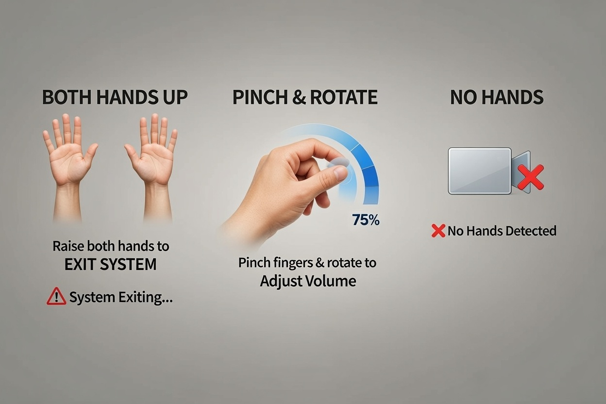

# Gesture based Volume Control System

## Overview

This project implements a gesture-based control system that allows users to interact with their computer using hand gestures. It detects specific hand movements and triggers corresponding actions such as adjusting volume or exiting the system.

<p style="color:#EE4B2B;font-weight:bolder;">NOTE : The current version only support unix based systems</p>

## Supported Gestures

1. **Both Hands Up (All Fingers Extended)**

   * **Action:** Exits the system immediately.
   * **Detection:** Checks that both hands are present, all fingers are extended, and hands are raised above the wrist.

2. **Pinch & Rotate**

   * **Action:** Adjusts system volume.
   * **Detection:** Detects pinch between thumb and index finger. Rotation of the pinched fingers changes the volume proportionally.

3. **No Gesture**

   * **Action:** No action is taken.
   * **Detection:** Hands are relaxed or not detected.

## Usage

1. **Requirements:**

   * Python 3.8+
   * NumPy
   * Hand landmarks detection library (e.g., MediaPipe)
   * Custom `utils.py` with `get_system_volume()` function

2. **Running the Program:**

   ```bash
   python main.py
   ```

3. **Workflow:**

   * Run the script.
   * Position your hands in front of the camera.
   * Use gestures to control system volume or exit.

## Code Structure

* `main.py` : Entry point, initializes camera and gesture detector.
* `gesture_detector.py` : Contains the `GestureDetector` class handling all gesture logic.
* `utils.py` : Utility functions (e.g., getting/setting system volume).

## Gesture Detector Logic

* Uses hand landmarks to calculate:

  * Pinch distance
  * Finger extension
  * Hand orientation
* Applies thresholds and smoothing to reduce false positives.
* Triggers actions based on detected gestures.

## Visual Guide

Refer to `gesture_illustrations.png` for a visual reference of gestures:

* **BOTH HANDS UP** → EXIT SYSTEM
* **PINCH & ROTATE** → ADJUST VOLUME
* **NO HANDS** → NO ACTION

## Notes

* Ensure the camera can clearly detect both hands.
* Avoid background clutter for better landmark detection.
* The system exits immediately when the BOTH HANDS UP gesture is recognized.

## Guide
<center>
   
</center>

## License

MIT License

## Developer

[Dunith Munasingha](https://dunith.is-a.dev/) (<dunith.munasingha@gmail.com>)